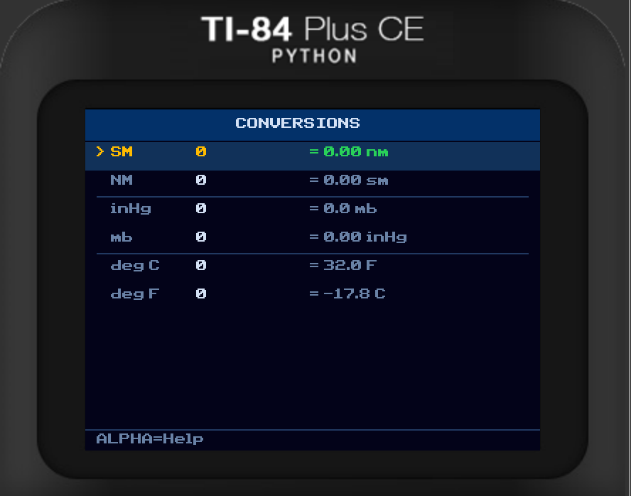

# E6B Flight Computer - TI-84 CE

A full-featured aviation E6B flight computer for the TI-84 Plus CE graphing calculator. Inspired by the ASA CX-3 feature set, this app covers everything from density altitude to weight and balance - right on your calculator.

**Version 1.0** - By [Andrew Sottile](https://github.com/coolpilot904)
Digital logbook: [log61.com](https://log61.com)

---

## Screenshots

| Standard Theme | Night Theme | Daylight Theme |
|:-:|:-:|:-:|
|  |  |  |

| Wind Correction | Weight & Balance | Conversions |
|:-:|:-:|:-:|
|  |  |  |

---

## Requirements

This app requires **CalcPlex** to run. CalcPlex is a launcher for the TI-84 Plus CE that allows running C programs.

If you have not set up CalcPlex yet, follow this tutorial first:
[https://calcplex.com/ti84plusce-jailbreak-tutorial/](https://calcplex.com/ti84plusce-jailbreak-tutorial/)

---

## Installation

1. Set up CalcPlex on your calculator using the tutorial above.
2. Download the files from the [Releases](../../releases) page:
   - `E6B.8xp` - launcher program
   - `E6B.8xp.0.8xv` - program data part 1
   - `E6B.8xp.1.8xv` - program data part 2
3. Transfer all three files to your TI-84 Plus CE using [TI Connect CE](https://education.ti.com/en/products/computer-software/ti-connect-ce-sw).
4. On the calculator, press `APPS`, select **CalcPlex**, then select **E6B**.

> All three files must be present on the calculator. The `.8xv` files are AppVars that store the program body (the app exceeds the 64 KB single-program limit).

---

## Features

### 1. Altitude
- Density Altitude
- Pressure Altitude
- DA from Pressure Altitude
- Cloud Base
- Standard Atmosphere lookup

### 2. Airspeed
- TAS from CAS/Altitude/Temp
- TAS from TAT (probe temperature, iterative Mach solve)
- Mach Number
- True Airspeed

### 3. Wind
- Wind Correction Angle & Ground Speed
- Find Wind (from HDG, TAS, GS, and course)
- Crosswind & Headwind components
- Ground Speed (distance/time)

### 4. Navigation
- Time/Speed/Distance
- Off-Course correction
- True/Magnetic heading conversion
- Holding Pattern entry type calculator (Direct / Teardrop / Parallel)

### 5. Fuel & ETA
- Fuel required
- Endurance
- ETA / Time en route
- Fuel flow

### 6. Weight & Balance
- Full multi-station W&B (Emp Wt, Fuel, Pilot, Co-Pilot, Pax 1/2, Bags, Cargo)
- Fuel toggle: AvGas or Jet-A (auto lb/gal conversion)
- Weight shift - new CG after moving an item
- Weight needed to shift CG by a desired amount

### 7. Conversions
- SM to/from NM
- inHg to/from mb
- Celsius to/from Fahrenheit

### 8. Theme
- **Standard** - dark blue cockpit style
- **Night** - green-on-black for dark cockpits
- **Daylight** - light background for bright conditions
- Theme is saved automatically and restored on next launch

### 9. About
- Credits and version info

---

## Controls

| Key | Action |
|-----|--------|
| Up / Down | Navigate fields / menu items (hold for fast scroll) |
| `ENTER` | Select / begin editing a field |
| `0-9` / `.` / `(-)` | Enter a value while editing |
| `DEL` | Backspace while editing |
| `ENTER` (while editing) | Confirm value |
| `CLEAR` | Cancel edit / go back / exit |
| `ALPHA` | Toggle context-sensitive help for current screen |
| `MODE` | Secondary actions (e.g. fuel type toggle in W&B) |

---

## Building from Source

Requires [CE Toolchain (CEdev)](https://github.com/CE-Programming/toolchain) v14.2 or later.

```sh
git clone https://github.com/coolpilot904/e6b-ce
cd e6b-ce
make
```

Output files will be in the `bin/` directory.

---

## About

Feature set based on the ASA CX-3 Flight Computer.
Built with [CE Toolchain](https://github.com/CE-Programming/toolchain) (ez80-clang).

---

*Check out my digital pilot logbook at [log61.com](https://log61.com)*
